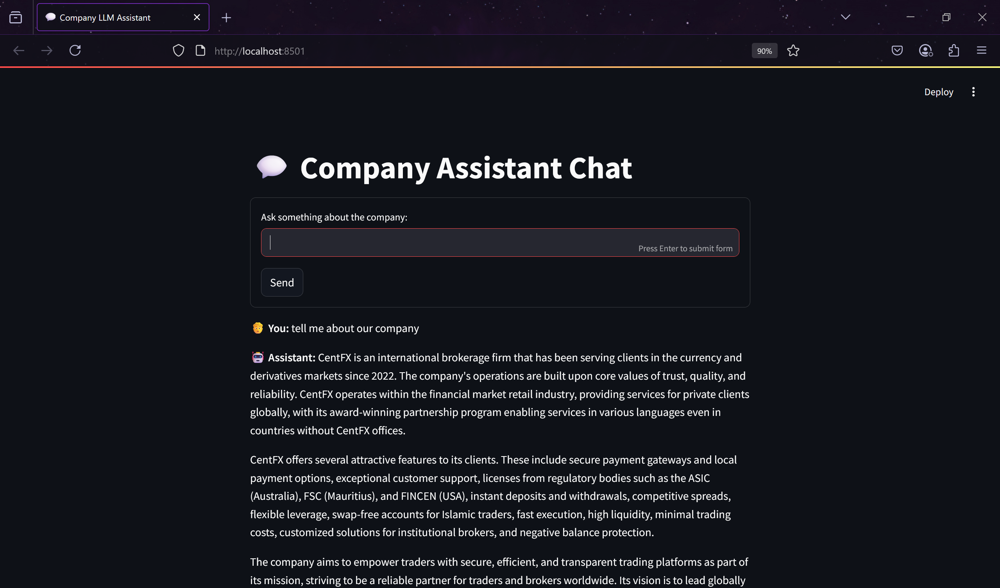

# Custom LLM Chat for Your Company Data

This project provides a simple local LLM-powered chatbot that answers questions based on your company's profile text using [Ollama](https://ollama.com/).

---

## Project Structure

custom-llm/ <br>
- app.py (Streamlit app - user interface & chat logic) <br>
- ollama_interface.py (Communicates with Ollama LLM via CLI subprocess) <br>
- rag_chain.py (Core logic to process questions & get answers) <br>
- config.py (Configuration variables (file paths, etc.)) <br>
- requirements.txt (Python dependencies list) <br>
- data/company_profile.txt (Company profile text file used as context) <br>


---

## Features

- Local LLM-powered chatbot using Ollama Mistral model
- Company-specific context injected from a plain text profile file
- Conversation-style UI
- Easy to run locally with Streamlit

---

## Installation & Setup

1. Clone the repo

2. Create and activate a Python virtual environment

3. Install dependencies:
    ```bash
    pip install --upgrade pip
    pip install -r requirements.txt
    ```

4. Add your company profile text to:
    ```
    data/company_profile.txt
    ```

5. Download & install Ollama from https://ollama.com/

6. Download the Mistral model and keep it running on a terminal:
    ```bash
    ollama run mistral
    ```
   

7. Start the Streamlit web app in a new terminal:
    ```bash
    streamlit run app.py
    ```
   

8. Open your browser and navigate to:
    ```
    http://localhost:8501
    ```
   
   
   
And Voila!!